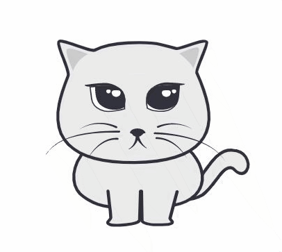

# Gato shell game

[](https://app.netlify.com/sites/gato-shell-game/deploys)

<p align="center">
 
 <a href="https://gato-shell-game.netlify.com/"><h3>Live demo</h3></a>
</p>

Gato is a light weight game using SVG and vanilla JavaScript.
It is my first attempt of [Affinity designer](https://affinity.serif.com/en-us/) and SVG animations without any front-end frameworks, inspired by the cute random cat gifs from the web.

## Test

```
yarn start
```

## Build

```
yarn build
```
